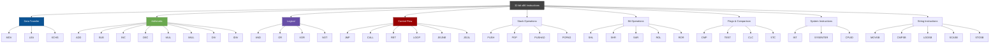

# x86 

```mermaid
flowchart TD

    IA[32-bit x86 Instructions]

    IA --> DT[Data Transfer]
    IA --> AR[Arithmetic]
    IA --> LG[Logical]
    IA --> CF[Control Flow]
    IA --> ST[Stack Operations]
    IA --> BO[Bit Operations]
    IA --> FL[Flags & Comparison]
    IA --> SY[System Instructions]
    IA --> STR[String Instructions]

    %% Data Transfer
    DT --> DT1[MOV]
    DT --> DT2[LEA]
    DT --> DT3[XCHG]

    %% Arithmetic
    AR --> AR1[ADD]
    AR --> AR2[SUB]
    AR --> AR3[INC]
    AR --> AR4[DEC]
    AR --> AR5[MUL]
    AR --> AR6[IMUL]
    AR --> AR7[DIV]
    AR --> AR8[IDIV]

    %% Logical
    LG --> LG1[AND]
    LG --> LG2[OR]
    LG --> LG3[XOR]
    LG --> LG4[NOT]

    %% Control Flow
    CF --> CF1[JMP]
    CF --> CF2[CALL]
    CF --> CF3[RET]
    CF --> CF4[LOOP]
    CF --> CF5[JE/JNE]
    CF --> CF6[JG/JL]

    %% Stack
    ST --> ST1[PUSH]
    ST --> ST2[POP]
    ST --> ST3[PUSHAD]
    ST --> ST4[POPAD]

    %% Bit Operations
    BO --> BO1[SHL]
    BO --> BO2[SHR]
    BO --> BO3[SAR]
    BO --> BO4[ROL]
    BO --> BO5[ROR]

    %% Flags
    FL --> FL1[CMP]
    FL --> FL2[TEST]
    FL --> FL3[CLC]
    FL --> FL4[STC]

    %% System
    SY --> SY1[INT]
    SY --> SY2[SYSENTER]
    SY --> SY3[CPUID]

    %% String Instructions
    STR --> STR1[MOVSB]
    STR --> STR2[CMPSB]
    STR --> STR3[LODSB]
    STR --> STR4[SCASB]
    STR --> STR5[STOSB]

    style IA fill:#434343,stroke:#000000,color:#ffffff
    style DT fill:#0b5394,stroke:#073763,color:#ffffff
    style AR fill:#6aa84f,stroke:#38761d,color:#ffffff
    style LG fill:#674ea7,stroke:#351c75,color:#ffffff
    style CF fill:#990000,stroke:#660000,color:#ffffff
```
