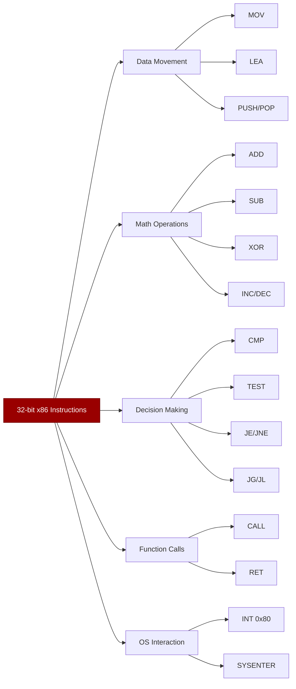

# Guide to Programming in 32-bit x86 Assembly Language

```mermaid
flowchart LR

    A[32-bit x86 Instructions]

    A --> B[Data Movement]
    A --> C[Math Operations]
    A --> D[Decision Making]
    A --> E[Function Calls]
    A --> F[OS Interaction]

    B --> B1[MOV]
    B --> B2[LEA]
    B --> B3[PUSH/POP]

    C --> C1[ADD]
    C --> C2[SUB]
    C --> C3[XOR]
    C --> C4[INC/DEC]

    D --> D1[CMP]
    D --> D2[TEST]
    D --> D3[JE/JNE]
    D --> D4[JG/JL]

    E --> E1[CALL]
    E --> E2[RET]

    F --> F1[INT 0x80]
    F --> F2[SYSENTER]

    style A fill:#990000,stroke:#660000,color:#ffffff
```
